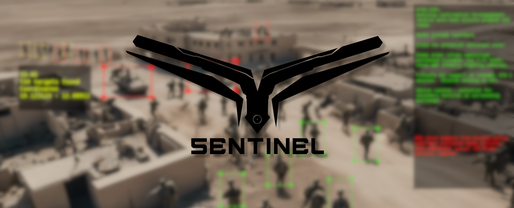
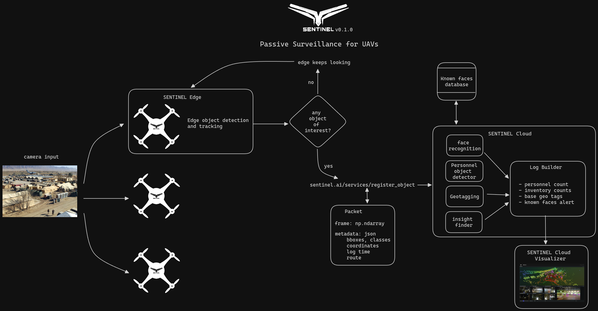

# sentinel-edge
Edge-optimized software to provide Sentinels (drones) with AI and communication with SENTINEL Cloud.

<p align="center">
  
</p>

# SENTINEL
Project SENTINEL is an UAV-based AI-powered toolset designed for autonomous military reconnaisance missions. SENTINEL provides near real-time target detection and identification, both for civil or remote areas.

SENTINEL is based on a two-tier architecture:

- SENTINEL Cloud: Acts as the central hub, providing advanced AI functionalities for object detection, analysis, and event management. It also serves as the control center for raising alerts and coordinating responses.
- SENTINEL Edge: Deployed on individual UAVs (Sentinels), equipped with high-performance object detection models for real-time analysis at the edge. SENTINEL Edge communicates with the SENTINEL Cloud via secure RESTful APIs.

## sentinel-edge
SENTINEL Edge is the edge-side of the Sentinel project. The goal of this library is to implement the basic functionalities to bring advanced computer vision algorithms to edge devices and UAVs. While the repository is focused on aerial applications, most of the infraestructure, models and code in this repiository can be reused in any application that aims to deploy computer vision to resource-constrained devices.

Now, these are the functionalities on SENTINEL Edge:
- Object detection
- Object tracking

SENTINEL Edge refreshes the list of _objects of interest_ each time a SENTINEL is turned on, by sending a GET request to the SENTINEL Cloud `interest_objects_list` API.

## SENTINEL Tasks
There are two main tasks that SENTINEL aims to bring to UAVs:

- **Passive Surveillance** (WIP): Focused on increasing UAVs capabilities by the usage of artificial intelligence models, both on the device and with advanced services on the cloud. The passive surveillance task is an add-on to the existing technologies of UAV-based monitoring, such as mission planners and human-controlled missions. Useful when the user already have UAV pilots or well-designed surveillance missions, SENTINEL Passive Surveillance brings advanced analytics to video-capable UAVs.
- **Active Surveillance** (Future): The next step for UAVs' autonomy, built on top of SENTINEL Passive Suveillance functionalities, SENTINEL Active Surveillance brings automated control and intelligent mission plans. While Passive Surveillance depended on a pilot or a pre-defined mission, Active Surveillance allows SENTINEL to control the UAVs to improve routes based on AI.

## Passive Surveillance task
<p align="center">
  
</p>

The most basic task of SENTINEL is the **Passive Surveillance**, which basically consists on giving the UAVs the ability to run an object detector and tracker, and report any find of a target object via the ```register_object``` API. The basic flow looks like this:

1. The UAVs running SENTINEL Edge will be monitoring (based on a mission plan, route, or manual control) everything in their cameras.
2. If SENTINEL Edge detects any object of interest (military bases, personnel, trucks, ships, planes), a Packet will be sent to SENTINEL Cloud via the ```register_object``` API. The packet will include the complete frame, as well as the event metadata: event time, bounding boxes, classes, coordinates, Sentinel ID (unique identifier for the UAV).
3. SENTINEL Cloud will be constantly listening for objects, once an event is registered, the cloud will run a comprehensive search for additional objects the image, if there are findings, the reports will be updated and send to the Cloud Visualizer.
4. A log builder that lives in SENTINEL Cloud will create a log entry for the Visualizer, which is a web-based tool for visualizing multimodal data over time.